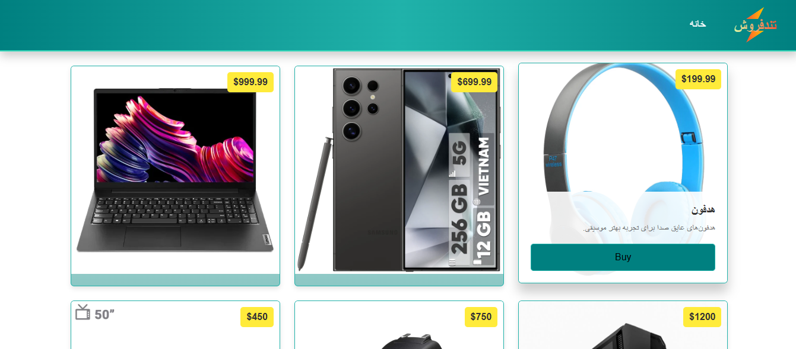

### Other Versions

<kbd>[](../README.md)</kbd>

# TondForoosh

TondForoosh is intended to be an online store. Our goal in creating this project is to build a beautiful and efficient online store with features such as product viewing, adding products, creating user accounts, filtering products by price/category, and online payment. This project uses technologies such as .NET Core for the server-side and React JS for the client-side. Our commitment is to continue developing this project to create a strong, efficient, and beautiful project. We invite all dear colleagues to collaborate, and we welcome any type of contribution, including documentation writing, testing, backend, and frontend development, to make the project better and more powerful. Our approach to developing this project is iterative and step-by-step. As the [project initiator](https://github.com/mohammadnazarkhani), I will not hesitate to develop this project whenever I find time until it reaches a satisfactory level.

## Table of Contents

- [TondForoosh](#tondforoosh)
  - [Table of Contents](#table-of-contents)
  - [Technologies Used](#technologies-used)
    - [Frontend](#frontend)
    - [Backend](#backend)
  - [Getting Started](#getting-started)
    - [Backend Setup](#backend-setup)
    - [Frontend Setup](#frontend-setup)
  - [Screenshot](#screenshot)

## Technologies Used

### Frontend

- React
- Axios for API requests
- React Bootstrap for UI design

### Backend

- ASP.NET Core
- Entity Framework Core for data access
- SQL Server for the database
- xUnit for backend testing

## Getting Started

For now, to keep the project simple, we have not containerized it. Therefore, please manually set up the project in your development environment. Start with the backend.

### Backend Setup

1. Install the required software such as .NET SDK version 6, SQL Server, and a text editor or IDE (such as Visual Studio, VS Code, or JetBrains Rider).
2. Configure the appropriate connection string for your installed SQL Server instance in the `appsettings.json` file located in the `\TondForooshApi` directory.
3. Run the `dotnet restore` command in the `\TondForooshApi` project directory:

```bash
dotnet restore
```

4. Run the project using the `dotnet run/watch` command:

```bash
dotnet run
```

### Frontend Setup

1. [Download](https://nodejs.org/en/download) and install Node.js.
2. Run the command to install the required libraries in the `\TondForooshFrontend` directory:

```bash
npm install
```

3. Run the project with the command:

```bash
npm run dev
```

## Screenshot


