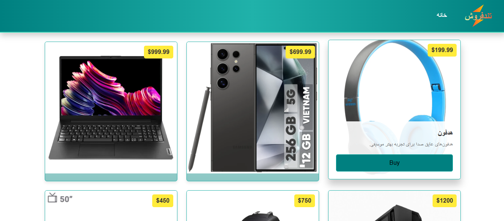

### Other Versions

<kbd>[](./Documentation/README_EN.md)</kbd>

# TondForoosh

تندفروش قرار است یک فروشگاه آنلاین باشد. هدف ما از ایجاد این پروژه ساخت یک فروشگاه آنلاین، زیبا و کارآمد با قابلیت‌هایی همچون مشاهده محصولات، افزودن محصولات، ساخت حساب کاربری، فیلتر محصولات برحسب قیمت/دسته‌بندی و امکان پرداخت آنلاین باشد. این پروژه با استفاده از تکنولوژی‌هایی همچون .NET Core برای سمت سرور و React JS برای سمت مشتری می‌باشد. تعهد ما بر این است که به توسعه این پروژه ادامه دهیم تا یک پروژه قوی، کارآمد و زیبا بسازیم. از همه همکاران عزیز دعوت به همکاری می‌کنیم و هر نوع مشارکتی اعم از داکیومنت نویسی، تست، بک‌اند و فرانت‌اند که در جهت توسعه و بهتر و قدرتمندتر شدن پروژه باشد استقبال می‌کنیم. راهکار ما برای توسعه این پروژه به‌صورت چرخشی و مرحله‌به‌مرحله می‌باشد. بنده به‌عنوان [شروع‌کننده پروژه](https://github.com/mohammadnazarkhani) هر زمان که وقتی برای توسعه این پروژه پیدا کنم دریغ نخواهم کرد تا زمانی که به یک حد قابل رضایتی برسد.

## فهرست مطالب

- [TondForoosh](#tondforoosh)
  - [فهرست مطالب](#فهرست-مطالب)
  - [تکنولوژی‌های استفاده شده](#تکنولوژیهای-استفاده-شده)
    - [فرانت‌اند](#فرانتاند)
    - [بک‌اند](#بکاند)
  - [شروع به کار پروژه](#شروع-به-کار-پروژه)
    - [راه‌اندازی بک‌اند](#راهاندازی-بکاند)
    - [راه‌اندازی فرانت‌اند](#راهاندازی-فرانتاند)
  - [اسکرین‌شات](#اسکرینشات)

## تکنولوژی‌های استفاده شده

### فرانت‌اند

- React
- Axios برای درخواست‌های API
- React Bootstrap برای طراحی رابط کاربری

### بک‌اند

- ASP.NET Core
- Entity Framework Core برای دسترسی به داده‌ها
- SQL Server برای پایگاه داده
- xUnit برای تست بک‌اند

## شروع به کار پروژه

فعلاً تا اینجای پروژه به‌دلیل ساده نگه‌داشتن پروژه، آن را containerize نکرده‌ایم و بنابراین فعلاً کارهای راه‌اندازی پروژه را در محیط توسعه خودتان به‌صورت دستی انجام بدهید. ابتدا از سمت بک‌اند شروع کنید.

### راه‌اندازی بک‌اند

1. نصب نرم‌افزارهای مورد نیاز همچون .NET SDK ورژن 6 و SQL Server و یک ویرایشگر متن یا IDE (همچون Visual Studio, VS Code یا JetBrains Rider)
2. تنظیم connection string مناسب پیکربندی نمونه نصب شده SQL Server شما در فایل `appsettings.json` در مسیر `\TondForooshApi`
3. اجرای دستور `dotnet restore` در مسیر پروژه `\TondForooshApi`:

```bash
dotnet restore
```

4. اجرای دستور `dotnet run/watch` جهت اجرای پروژه

```bash
dotnet run
```

### راه‌اندازی فرانت‌اند

1. [دانلود](https://nodejs.org/en/download) و نصب Node.js
2. اجرای دستور نصب کتابخانه‌های مورد نیاز در مسیر `\TondForooshFrontend`:

```bash
npm install
```

3. اجرای پروژه با دستور:

```bash
npm run dev
```

## اسکرین‌شات


