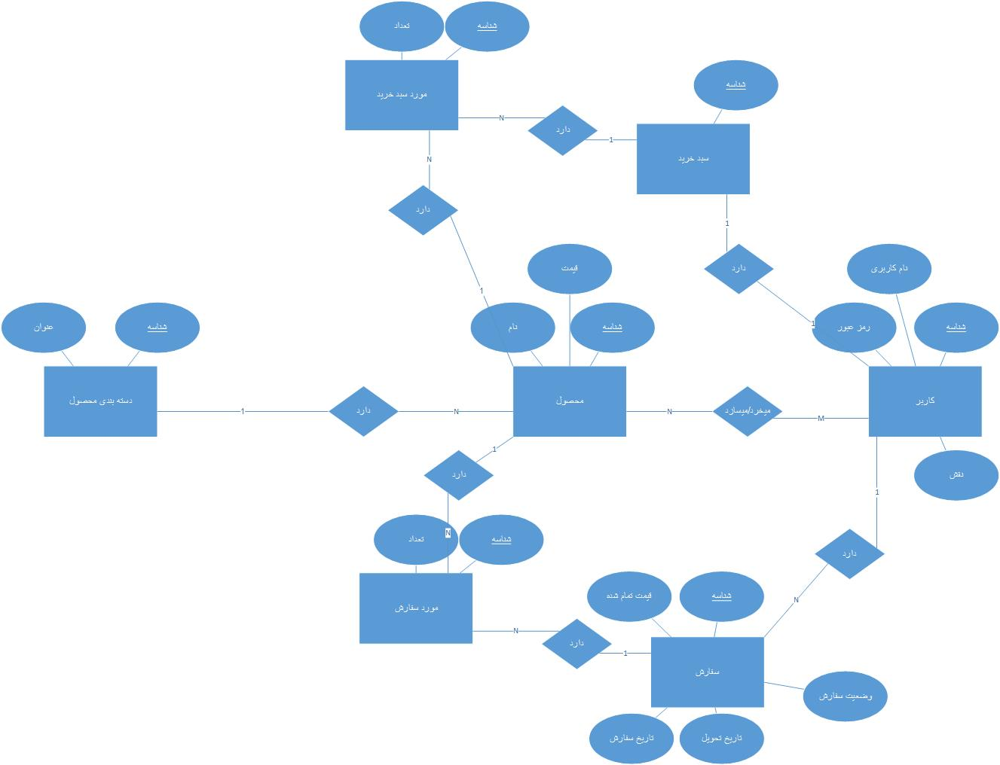

# طراحی پایگاه داده وب‌سایت

پایگاه داده وب‌سایت به‌طور اولیه برای پشتیبانی از عملکردهای اصلی سایت طراحی شده است. این طرح در آینده قابل توسعه و پیچیده‌تر شدن است تا قابلیت‌های بیشتری را پشتیبانی کند.

## موجودیت‌های پایگاه داده

### 1. موجودیت: کاربر (User)

این موجودیت برای ذخیره اطلاعات کاربران سایت طراحی شده است. فیلدهای آن به شرح زیر است:

- **شناسه (ID):** کلید اصلی برای شناسایی و تفکیک کاربران
- **نام کاربری (Username):** نام منحصر به فرد برای ورود کاربران
- **رمز عبور (Password):** رمز عبور برای احراز هویت کاربر
- **نقش (Role):** نقش کاربر در سایت (برای مثال: مدیر، کاربر عادی)

### 2. موجودیت: محصول (Product)

این موجودیت اطلاعات مربوط به محصولات سایت را نگهداری می‌کند. فیلدهای آن عبارتند از:

- **شناسه (ID):** کلید اصلی برای شناسایی محصولات
- **نام (Name):** نام محصول
- **قیمت (Price):** قیمت محصول

### 3. موجودیت: دسته‌بندی محصول (Product Category)

این موجودیت برای دسته‌بندی محصولات به گروه‌های مختلف طراحی شده است. فیلدهای آن به شرح زیر است:

- **شناسه (ID):** کلید اصلی برای شناسایی دسته‌بندی‌ها
- **عنوان (Title):** نام دسته‌بندی (برای مثال: موبایل‌ها، لباس‌ها، لوازم خانگی و...)

### 4. موجودیت: سبد خرید (Shopping Cart)

این موجودیت به هر کاربر امکان می‌دهد تا محصولات خود را برای خرید ذخیره کرده و مدیریت کند. فیلدهای آن به شرح زیر است:

- **شناسه (ID):** کلید اصلی برای شناسایی سبد خرید

### 5. موجودیت: مورد سبد خرید (Cart Item)

این موجودیت جزئیات هر محصولی را که در سبد خرید یک کاربر قرار دارد ذخیره می‌کند. فیلدهای آن عبارتند از:

- **شناسه (ID):** کلید اصلی برای شناسایی مورد سبد خرید
- **تعداد (Quantity):** تعداد محصول در سبد خرید

### 6. موجودیت: سفارش (Order)

این موجودیت اطلاعات مربوط به سفارش‌های کاربران را ذخیره می‌کند. فیلدهای آن به شرح زیر است:

- **شناسه (ID):** کلید اصلی برای شناسایی سفارش‌ها
- **قیمت تمام شده (Total Price):** قیمت کل سفارش
- **تاریخ سفارش (Order Date):** تاریخ ثبت سفارش
- **تاریخ تحویل (Delivery Date):** تاریخ مورد انتظار تحویل سفارش
- **وضعیت سفارش (Order Status):** وضعیت فعلی سفارش (برای مثال: در حال پردازش، ارسال شده، تحویل داده شده)

### 7. موجودیت: مورد سفارش (Order Item)

این موجودیت اطلاعات مربوط به هر محصول در یک سفارش را ذخیره می‌کند. فیلدهای آن عبارتند از:

- **شناسه (ID):** کلید اصلی برای شناسایی مورد سفارش
- **تعداد (Quantity):** تعداد محصول در سفارش
- **قیمت تمام شده (Total Price):** قیمت نهایی محصول در سفارش (با احتساب تخفیف‌ها، مالیات‌ها و...)

## روابط بین موجودیت‌ها

در این بخش به روابط بین موجودیت‌های مختلف پایگاه داده می‌پردازیم:

### 1. کاربر - سبد خرید (User - Shopping Cart)

- هر کاربر می‌تواند یک سبد خرید داشته باشد.
- رابطه: یک به یک (One-to-One)

### 2. کاربر - سفارشات (User - Orders)

- هر کاربر می‌تواند چندین سفارش داشته باشد.
- رابطه: یک به چند (One-to-Many)

### 3. سبد خرید - مورد سبد خرید (Shopping Cart - Cart Item)

- هر سبد خرید می‌تواند شامل چندین محصول باشد.
- رابطه: یک به چند (One-to-Many)

### 4. محصول - دسته‌بندی محصول (Product - Product Category)

- هر محصول باید در یک دسته‌بندی خاص قرار گیرد.
- رابطه: چند به یک (Many-to-One)

### 5. محصول - مورد سبد خرید (Product - Cart Item)

- هر محصول می‌تواند در چندین مورد سبد خرید قرار گیرد.
- رابطه: یک به چند (One-to-Many)

### 6. سفارش - مورد سفارش (Order - Order Item)

- هر سفارش می‌تواند شامل چندین محصول باشد.
- رابطه: یک به چند (One-to-Many)

### 7. محصول - مورد سفارش (Product - Order Item)

- هر محصول می‌تواند در چندین مورد سفارش قرار گیرد.
- رابطه: یک به چند (One-to-Many)

---

این توضیحات روابط بین موجودیت‌ها، به شما کمک می‌کند تا ساختار و نحوه ارتباط داده‌ها در پایگاه داده را بهتر درک کنید. این روابط اساساً نحوه تعامل و اتصال بین داده‌ها را در سیستم شما مشخص می‌کند.

## طراحی پایگاه داده

### اسکرین‌شات از طراحی پایگاه داده

در اینجا تصویری از طراحی پایگاه داده به صورت گرافیکی آورده شده است:

### فایل طراحی با نرم‌افزار Visio

برای مشاهده جزئیات بیشتر از طراحی پایگاه داده، می‌توانید از فایل طراحی شده در نرم‌افزار Visio استفاده کنید:

[دانلود فایل Visio - TondForoosh.DatabaseDesign.vsdx](assets/TondForoosh.DatabaseDesign.vsdx)
